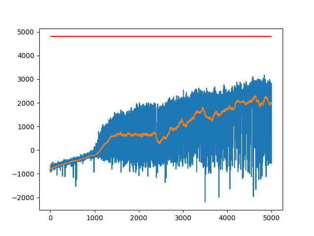

# ppo-pytorch

implementation of ppo(proximal policy optimization) using pytorch

# training result

> red line represents the goal of the environment, specified by open ai gym

> note that not all of these goals are reached,<br>
> but does achieve similar results to
> [figure 3 of the original paper](
> https://openai-public.s3-us-west-2.amazonaws.com/blog/2017-07/ppo/ppo-arxiv.pdf#page=7), <br>
> and better than results in [Benchmarks for Spinning Up Implementations](
> https://spinningup.openai.com/en/latest/spinningup/bench.html).

> note that I didn't specify seed, so you may get a different result,<br>
> however, according to my experience, this code could achieve similar results across different seeds,<br>
> so you can get a result that is not so bad after trying with a few seeds(or even not specified).

### Pendulum-v0

```commandline
python main.py --env-name "Pendulum-v0" --learning-rate 0.0003 --learn-interval 1000 --batch-size 200 --total-steps 300000 --num-process 3
```

|reward and running reward|multiple running rewards|
|---|---|
||.png)

### HalfCheetah-v3

```commandline
python main.py --env-name "HalfCheetah-v3" --total-steps 5000000 --learn-interval 2000 --learning-rate 0.0007 --batch-size 2000
```

|reward and running reward|multiple running rewards|
|---|---|
||.png)

### Swimmer-v3

```commandline
python main.py --env-name "Swimmer-v3" --total-steps 1000000 --learn-interval 2000 --learning-rate 0.0005 --batch-size 1000 --std-decay
```

|reward and running reward|multiple running rewards|
|---|---|
||.png)

### Hopper-v3

```commandline
python main.py --env-name "Hopper-v3" --total-steps 5000000 --learn-interval 2000 --learning-rate 0.0005 --batch-size 1000 --std-decay
```

|reward and running reward|multiple running rewards|
|---|---|
||.png)

### Walker2d-v3

```commandline
python main.py --env-name "Walker2d-v3" --total-steps 5000000 --learn-interval 2000 --learning-rate 0.0005 --batch-size 1000 --std-decay
```

|reward and running reward|multiple running rewards|
|---|---|
||.png)

# reference

- [ppo by ikostrikov](https://github.com/ikostrikov/pytorch-a2c-ppo-acktr-gail)
- [ppo by nikhilbarhate99](https://github.com/nikhilbarhate99/PPO-PyTorch)

# todo

- discrete action